# Healthcare Stroke Prediction - Feast Feature Store Documentation
## Architecture Overview
This project implements a polyglot feature store architecture that unifies 5 heterogeneous data sources (PostgreSQL, MongoDB, MS SQL, MinIO S3, Spark) into a single Feast feature store for machine learning.

(extended from environment in https://github.com/ThatoK3/healthcare-feast-project.git)

```bash 
| Component     | Technology   | Purpose                                                 |
| --------------| ------------ | ------------------------------------------------------- |
| Registry      | PostgreSQL   | Stores feature definitions and metadata                 |
| Offline Store | PostgreSQL   | Historical training data with point-in-time correctness |
| Online Store  | Redis        | Sub-10ms feature serving for real-time inference        |
| Ingestion     | Spark        | Bridges MongoDB/MSSQL into Feast via PushSources        |
| UI            | Feast Web UI | Visual management of features and lineage               |

```

## Data Sources Mapped
* PostgreSQL: Clinical measurements (direct SQL)
* MinIO S3: Lifestyle data, Stroke outcomes (Parquet files)
* MongoDB: Patient demographics (via Spark PushSource)
* MS SQL: Hospital records (via Spark PushSource)
* Spark: Computed risk features (calculated in PySpark then pushed)

## Project Structure
```bash
healthcare-feast/
├── docker-compose.yml          # Container orchestration on external network
├── Dockerfile.feast            # Custom Feast image with PostgreSQL support
├── feature_repo/               # Feast repository (feature definitions)
│   ├── feature_store.yaml      # Core Feast configuration
│   ├── entities.py             # Patient entity definition
│   ├── data_sources.py         # All 6 data source connectors
│   ├── feature_views.py        # 6 feature view definitions
│   ├── feature_services.py     # Curated feature sets for ML
│   ├── materialize.py          # Offline→online sync script
│   └── test_workflow.py        # End-to-end validation
└── spark_feast_connector.py    # Spark ingestion from MongoDB/MSSQL
```

### 1. Dockerfile.feast
Extends official Feast image with PostgreSQL registry support.

**Key Installations**:
* feast[postgres]: Enables PostgreSQL-backed registry and offline store
* psycopg2-binary: PostgreSQL Python driver
* s3fs boto3: S3/MinIO connectivity
* redis: Redis client for online store
* pyspark: Spark integration for computed features


### 2. docker-compose.yml
Runs Feast UI/Server containers connected to existing infrastructure

**Key Configuration**:
* Network: Connects to spark-jupyter-scala_spark-net (external)
* Environment Variables: Passes all DB credentials to container
* Volumes: Mounts ./feature_repo for live code updates
* Command: Auto-runs feast apply on startup to register features
* Port Mapping: 8889:8889 (Feast UI accessible at localhost:8889)

### 3. feature_repo/feature_store.yaml
Core Feast configuration defining storage backends.
```bash
registry: 
  registry_type: sql                    # PostgreSQL-backed (not file-based)
  path: postgresql://...                # Shared across containers

offline_store:
  type: postgres                        # Training data stored here
  db_schema: feast_offline              # Isolated schema

online_store:
  type: redis                           # Real-time serving
  connection_string: healthcare-redis:6379,password=...
```

**Design Decision**: Uses PostgreSQL for both registry AND offline store to ensure consistency and shared state across multiple Feast instances.

### 4. feature_repo/entities.py
Defines the primary key linking all data sources.
```bash
patient = Entity(
    name="patient",
    join_keys=["patient_id"],           # Must exist in all data sources
    value_type=ValueType.STRING,
)
```

All feature views must share this entity key. Feast performs joins on patient_id when retrieving features from multiple sources.


### 5. feature_repo/data_sources.py
```bash
| Source Class       | Data System   | Pattern                                 |
| ------------------ | ------------- | --------------------------------------- |
| `PostgreSQLSource` | PostgreSQL    | Direct SQL queries                      |
| `FileSource` (S3A) | MinIO         | Parquet files with S3 endpoint override |
| `PushSource`       | MongoDB/MSSQL | Spark pushes data into Feast            |
```

**PushSource Pattern**:
* **Why**: Feast lacks native MongoDB/MSSQL offline stores
* **How**: Spark reads from these DBs, transforms data, calls store.push()
* **Batch Backend**: Each PushSource has underlying FileSource (MinIO Parquet) for historical storage

### 6. feature_repo/feature_views.py
Defines features extracted from each source (schema + metadata).

**Six Feature Views**:
* clinical_statistics (PostgreSQL): 3 features (glucose, BMI, BP)
* lifestyle_factors (MinIO S3): 5 features (smoking, exercise, diet)
* medical_conditions (MinIO S3): 7 features (conditions + target)
* patient_demographics (Push): 6 features (age, gender, region)
* hospitalization_metrics (Push): 7 features (admission status, days)
* computed_risk_metrics (Push): 6 features (risk_score 0-100)

TTL (Time-To-Live): Controls how far back Feast looks for feature values when performing point-in-time joins. Varies by data freshness requirements (30 days for computed, 3650 days for demographics).

### 7. feature_repo/feature_services.py
Curates feature subsets for specific ML models.

**Services Defined**:

**stroke_risk_v1**: Production service using 8 carefully selected features
* Excludes PII (physician names, insurance IDs)
* Excludes redundant fields (blood_type not used in model)
* Mixes from 5 different source systems

**stroke_risk_high_confidence**: Experimental using all 34 features

**Benefit**: Data scientists can subscribe to specific services without worrying about underlying source complexity.

### 8. spark_feast_connector.py
Bridges non-native sources (MongoDB, MSSQL) into Feast

#### Workflow:
1. Connect: Uses existing Spark cluster (spark://spark-master:7077)

2. Read: Pulls from MongoDB (connector) and MSSQL (JDBC)

3. Transform: Calculates age, hospitalization metrics, risk scores

4. Push: Calls store.push() to write to both Redis (online) and MinIO (offline)


**Key Code**:
```bash
store.push("patient_demographics", df, to=PushMode.ONLINE_AND_OFFLINE)
```

This simultaneously updates real-time serving and training datasets.


### 9. feature_repo/materialize.py
Syncs offline store (PostgreSQL) to online store (Redis).

When to Run:
* After initial data load
* On schedule (cron/Airflow) for incremental updates
* After new features are engineered in Spark


Command:
```bash
store.materialize(
    start_date=datetime.now() - timedelta(days=7),
    end_date=datetime.now()
)
```


### 10. feature_repo/test_workflow.py
Validates the entire Feast deployment.

Tests:
* Online Features: Retrieves from Redis for real-time simulation
* Historical Features: Retrieves from PostgreSQL with point-in-time correctness
* Source Validation: Tests all 6 source connections
* Feature Service Inspection: Lists available curated services

### Example usage
```python
from feast import FeatureStore
import pandas as pd

store = FeatureStore(repo_path=".")

# Training: Get historical features (point-in-time correct)
entity_df = pd.DataFrame({
    "patient_id": ["P00000001", "P00000002"],
    "event_timestamp": pd.to_datetime(["2024-01-01", "2024-01-15"])
})

training_df = store.get_historical_features(
    entity_df=entity_df,
    features=store.get_feature_service("stroke_risk_v1")
).to_df()

# Inference: Get real-time features (Redis)
online_features = store.get_online_features(
    features=store.get_feature_service("stroke_risk_v1"),
    entity_rows=[{"patient_id": "P00000001"}]
).to_dict()

model.predict(online_features)
```


### Archritecture - linked with https://github.com/ThatoK3/spark-jupyter-scala.git

```mermaid
graph TB
    %% EXTERNAL DATA SOURCES - Already Running in Docker
    subgraph DataSources ["External Data Sources (Docker Infrastructure)"]
        direction TB
        
        PostgreSQL["PostgreSQL: healthcare-postgres:5432
        - clinical_measurements table
        - patient_id (FK)
        - visit_date (timestamp)
        - avg_glucose_level
        - bmi, blood_pressure_systolic
        - PostgreSQL Registry (feast schema)
        - PostgreSQL Offline Store"]
        
        MinioLifestyle["MinIO S3: healthcare-minio:9000
        - Bucket: healthcare-lifestyle
        - File: lifestyle_data.parquet
        - patient_id (FK)
        - smoking_status
        - exercise_frequency
        - alcohol_consumption, diet_type"]
        
        MinioBatch["MinIO S3: healthcare-minio:9000
        - Bucket: healthcare-batch
        - File: stroke_outcomes.parquet
        - patient_id (FK)
        - hypertension (0/1)
        - heart_disease (0/1)
        - diabetes (0/1)
        - stroke_occurred (TARGET)"]
        
        MongoDB["MongoDB: healthcare-mongodb:27017
        - Collection: patient_demographics
        - patient_id (PK)
        - date_of_birth (age computed)
        - gender, blood_type
        - healthcare_region, insurance_type
        - Ingested via Spark PushSource"]
        
        MSSQL["MS SQL: healthcare-mssql:1433
        - Table: hospital_administration
        - patient_id (FK)
        - admission_date
        - discharge_status
        - department, physician
        - Ingested via Spark PushSource"]
        
        RedisDB["Redis: healthcare-redis:6379
        - Online Store
        - Key: patient:{id}:feature
        - TTL: 7 days"]
        
        SparkCluster["Spark Cluster: spark-master:7077
        - jupyter-spark notebook
        - MongoDB connector (Spark)
        - MSSQL connector (JDBC)
        - MinIO S3A connector
        - Computed features engine
        - Push to Feast API"]
    end
    
    %% FEAST CONTAINERS - Custom Build
    subgraph FeastSystem ["Feast Feature Store (healthcare-feast-ui:8889)"]
        direction TB
        
        subgraph Build ["Build Configuration"]
            Dockerfile["Dockerfile.feast
            - Base: feastdev/feature-server:latest
            - pip install feast[postgres]
            - pip install psycopg2-binary
            - pip install s3fs boto3
            - pip install redis pyspark"]
        end
        
        subgraph Config ["Configuration"]
            YAML["feature_store.yaml
            - Registry: postgresql://...
            - Offline: postgres (healthcare DB)
            - Online: redis (healthcare-redis:6379)
            - Project: healthcare_stroke_prediction"]
        end
        
        subgraph Sources ["Data Source Connectors"]
            PostgresSource["PostgreSQLSource
            - clinical_measurements
            - timestamp_field: visit_date"]
            
            MinioSource1["FileSource (S3A)
            - s3://healthcare-lifestyle/lifestyle_data.parquet
            - endpoint: healthcare-minio:9000"]
            
            MinioSource2["FileSource (S3A)
            - s3://healthcare-batch/stroke_outcomes.parquet
            - endpoint: healthcare-minio:9000"]
            
            MongoPush["PushSource
            - name: patient_demographics
            - batch_source: s3://healthcare-feast/demographics.parquet
            - populated_by: Spark"]
            
            MSSQLPush["PushSource
            - name: hospital_administration
            - batch_source: s3://healthcare-feast/hospital.parquet
            - populated_by: Spark"]
            
            SparkPush["PushSource
            - name: computed_risk_features
            - batch_source: s3://healthcare-feast/computed.parquet
            - populated_by: Spark"]
        end
        
        subgraph Entity ["Entity Definition"]
            Patient["patient
            - join_key: patient_id
            - value_type: STRING"]
        end
        
        subgraph FeatureViews ["Feature Views"]
            ClinicalView["clinical_statistics
            - Source: PostgreSQL
            - Features: glucose, bmi, bp_systolic"]
            
            LifestyleView["lifestyle_factors
            - Source: MinIO S3
            - Features: smoking, exercise, alcohol"]
            
            ConditionView["medical_conditions
            - Source: MinIO S3
            - Features: htn, heart_disease, diabetes"]
            
            DemoView["patient_demographics
            - Source: Push (MongoDB)
            - Features: age, gender, region"]
            
            HospitalView["hospitalization_metrics
            - Source: Push (MSSQL)
            - Features: was_hospitalized, days_since_admission"]
            
            ComputedView["computed_risk_metrics
            - Source: Push (Spark)
            - Features: risk_score (0-100), age_group"]
        end
        
        subgraph Services ["Feature Services"]
            StrokeRiskV1["stroke_risk_v1
            - clinical_statistics: glucose, bmi
            - patient_demographics: age, gender
            - lifestyle_factors: smoking_status
            - computed_risk_metrics: risk_score, condition_count
            - 8 features selected from 20+ available"]
            
            StrokeRiskHighConf["stroke_risk_high_confidence
            - All features included"]
        end
    end
    
    %% CONSUMPTION LAYER
    subgraph Consumption ["ML Training & Inference"]
        Training["Training (Offline)
        - get_historical_features()
        - Source: PostgreSQL offline store
        - Point-in-time correct joins
        - Feature service: stroke_risk_v1"]
        
        Inference["Inference (Online)
        - get_online_features()
        - Source: Redis online store
        - Latency: <10ms"]
    end
    
    %% DATA FLOWS
    PostgreSQL -->|"PostgreSQLSource"| PostgresSource
    MinioLifestyle -->|"FileSource (S3A)"| MinioSource1
    MinioBatch -->|"FileSource (S3A)"| MinioSource2
    
    MongoDB -->|"Spark ingestion"| SparkCluster
    MSSQL -->|"Spark ingestion"| SparkCluster
    SparkCluster -->|"feast.push()"| MongoPush
    SparkCluster -->|"feast.push()"| MSSQLPush
    SparkCluster -->|"feast.push()"| SparkPush
    
    PostgresSource -->|"defines"| ClinicalView
    MinioSource1 -->|"defines"| LifestyleView
    MinioSource2 -->|"defines"| ConditionView
    MongoPush -->|"defines"| DemoView
    MSSQLPush -->|"defines"| HospitalView
    SparkPush -->|"defines"| ComputedView
    
    ClinicalView -->|"entity"| Patient
    LifestyleView -->|"entity"| Patient
    ConditionView -->|"entity"| Patient
    DemoView -->|"entity"| Patient
    HospitalView -->|"entity"| Patient
    ComputedView -->|"entity"| Patient
    
    ClinicalView -->|"materialize"| RedisDB
    LifestyleView -->|"materialize"| RedisDB
    ConditionView -->|"materialize"| RedisDB
    DemoView -->|"materialize"| RedisDB
    HospitalView -->|"materialize"| RedisDB
    ComputedView -->|"materialize"| RedisDB
    
    ClinicalView -->|"subset"| StrokeRiskV1
    DemoView -->|"subset"| StrokeRiskV1
    LifestyleView -->|"subset"| StrokeRiskV1
    ComputedView -->|"subset"| StrokeRiskV1
    
    StrokeRiskV1 -->|"get_historical_features()"| Training
    RedisDB -->|"get_online_features()"| Inference
    
    %% NETWORK
    subgraph Networking ["Docker Networks"]
        SparkNet["External: spark-jupyter-scala_spark-net
        - jupyter-spark
        - spark-master/workers
        - livy-server"]
        
        FeastConnects["Feast Container connects to:
        - healthcare-postgres (5432)
        - healthcare-redis (6379)
        - healthcare-minio (9000)
        - healthcare-mongodb (27017)
        - healthcare-mssql (1433)
        - spark-master (7077)"]
    end
    
    FeastSystem -->|"connects"| SparkNet
    FeastSystem -->|"uses"| PostgreSQL
    FeastSystem -->|"uses"| RedisDB
    
    %% Styling
    style DataSources fill:#f0f0f0,stroke:#333,stroke-width:2px
    style FeastSystem fill:#e8f4f8,stroke:#333,stroke-width:2px
    style Sources fill:#fff3cd,stroke:#856404,stroke-width:2px
    style Entity fill:#d4edda,stroke:#155724,stroke-width:2px
    style FeatureViews fill:#d1ecf1,stroke:#0c5460,stroke-width:2px
    style Services fill:#d4edda,stroke:#155724,stroke-width:2px
    style Consumption fill:#f0f0f0,stroke:#333,stroke-width:2px
    style Networking fill:#f5f5f5,stroke:#666,stroke-width:1px
    style Build fill:#fff3cd,stroke:#856404,stroke-width:1px
    style Config fill:#e3f2fd,stroke:#1565c0,stroke-width:1px
```

